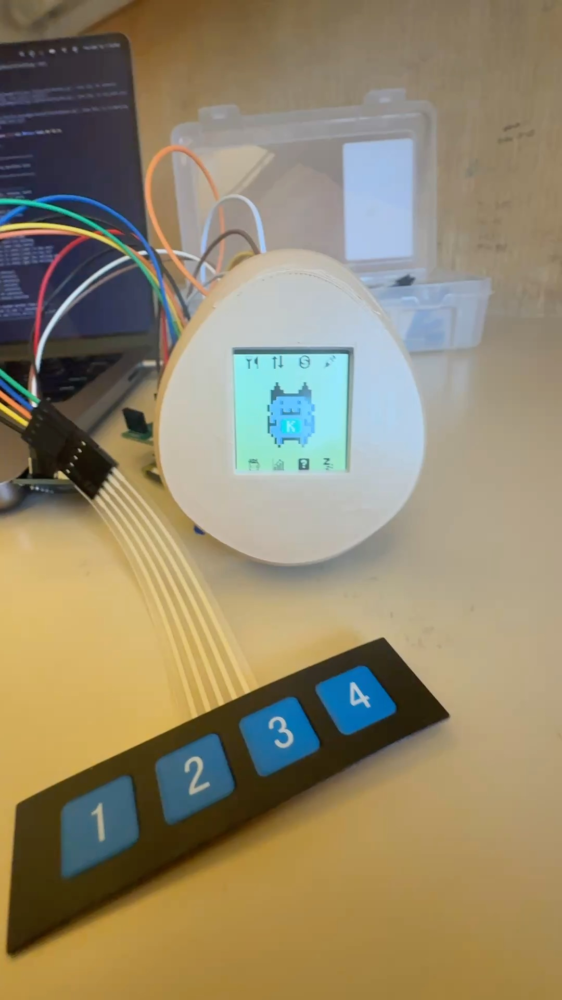

# Tamagacha (Kalshi trading Tamagotchi)

For our CS140E final project, we built a custom Tamagotchi companion that lives or dies based on real-world Kalshi trades. Running entirely bare-metal on a Raspberry Pi, the system forces users to maintain an active portfolio. If you don't make at least one transaction every 24 hours, or if you hit a 3-trade losing streak, the Tamagotchi dies.

---

## Demo and Hardware

*Click above to watch the full demo on YouTube*

**Hardware Prototype:**

  

---

## Features and Menus

We hand-drew over 40 frames and animations, creating 6 interactive menus to interface directly with a Kalshi account:

* **Food Menu (Portfolio):** Displays your top 7 Kalshi holdings by volume. You can buy or sell current holdings in increments of 1, 5, 10, or MAX.
* **Game Menu (Simulator):** A risk-free "Higher or Lower" trading simulator using random markets from the Kalshi API. High scores are saved locally to the Pi.
* **Health & Status:** Displays remaining "hearts" (consecutive losses allowed before death) and a 24-hour countdown timer to the next required trade.
* **Statistics:** Tracks the Tamagotchi's age, total earnings, current balance, and other lifetime stats.
* **Gacha Mode:** Pulls a random market from Kalshi and automatically places a bet to diversify the portfolio.

---

## Hardware and Drivers

This project was built bare-metal, requiring custom drivers for all peripherals:

* **Display:** SPI driver for an ST7735R 1.44" LCD display (128x128 resolution).
* **Timekeeping:** Bit-banged I2C driver for a PCF8523 RTC. This tracks the Tamagotchi's age, offline time, and the 24-hour trade deadline.
* **Input:** A 4-button membrane keypad using fast interrupts to minimize trading latency.
* **API Communication:** The Pi communicates over UART to a host PC running a custom Python client. The Python client uses `pyserial` to parse Pi commands, fetch portfolio balances via the Kalshi API, and execute trades.

---

## File Storage 

To save the game state between reboots, we extended the class FAT32 filesystem lab to support file writing. We read and write to a configuration `.txt` file on the SD card to track persisting elements:
* Birthdate and Age
* Last trade timestamp (for the countdown ticker)
* Portfolio statistics (starting balance, peak balance)
* Current Win/Loss streak (hearts remaining)
* State (Healthy, Sick, Dead) and Level

---

## Optimizations

To ensure the UI remained responsive while communicating over UART, we implemented several optimizations based on CS340LX:

* Enabled instruction cache (i-cache) and branch prediction buffer.
* Compiled with `-O3`.
* Shortened interrupt handlers in both C and assembly.
* Removed development barriers.
* Inlined GPIO operations.
* Enabled fast interrupts and async edges.
* Increased the ARM clock frequency to 1150 MHz and the UART baud rate to 921600.

---

## Notes

**Python Client Setup:**
The host PC handles the Kalshi API requests. The full workflow for the Python client is described in `trading-Tamagotchi/pi-to-comp-how-to.txt`.

**Class Repo Dependency:**
We didn't change how/when the code links to the `$CS140E_2026_REPO`. Because we heavily modified the UART and baud rate settings, our code pulls those specific configurations from the class repository rather than this local one. If you are referencing this project, you must make the corresponding UART/baud rate changes in your own class repo.
